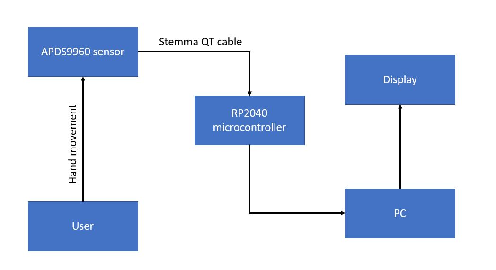

University of Pennsylvania, ESE 5190: Intro to Embedded Systems, Lab 1
    
    
    Yash Budhe
        LinkedIn: https://www.linkedin.com/in/yash-mb-a1723812b
    Tested on: HP Envy x360 Convertible, 11th Gen Intel(R) Core(TM) i7-1165G7 @ 2.80GHz 

# 3.2 - Firefly

The embedded system reacts to the firefly video on youtube. The brightness of the LED light on the MCU scales with light intensity falling on the sensor. The blue light gets brighter when more light is there and gets dimmer with reducing light and eventually disappers when the sensor is in dark.

# 4.4 - Custom Visualizer Overview: 

This is a motion detector which permits the side (left and right) motion (hand gestures) by signaling a green light and blinks red whenever a perpendicular (up and down) motion is detected. For this purpose a RP2040 microcontroller connected APDS9960 sensor through a Stemma QT cable is used. 

Instructions:

1. Hold the sensor in this position. 

2. Move your hand on the sensor. Check the notepad. The microcontroller will blink red or green depending upon the direction of hand motion and HID keyboard types the corresponding text on the notepad ("Moving up"/"Moving left").

3. To stop the algorithm from running, use a mobile flaslight on the sensor. Microcontroller will blink blue (not clearly visible) and the code will stop with a message "Detector stopped".

# Diagram of embedded system setup

